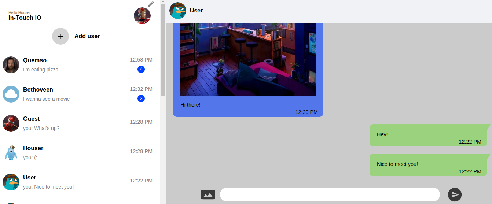
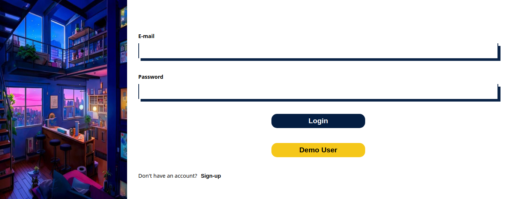
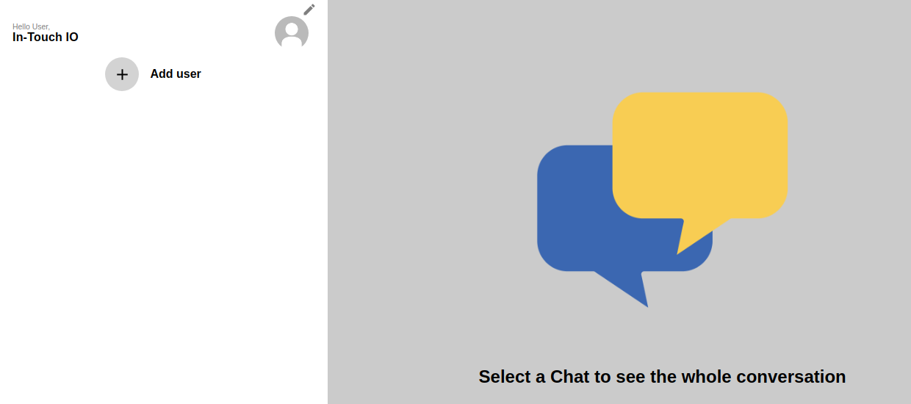
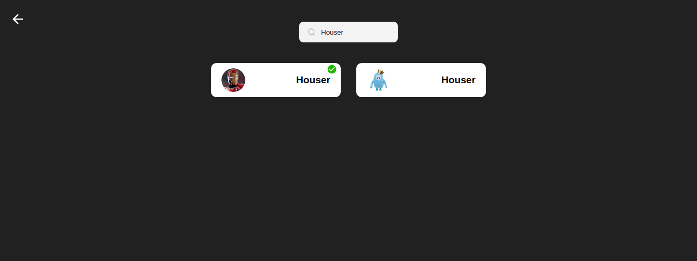
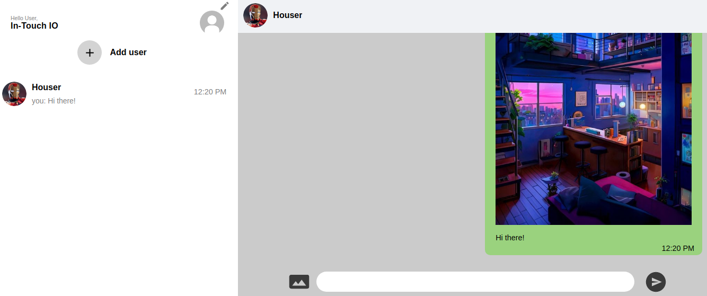
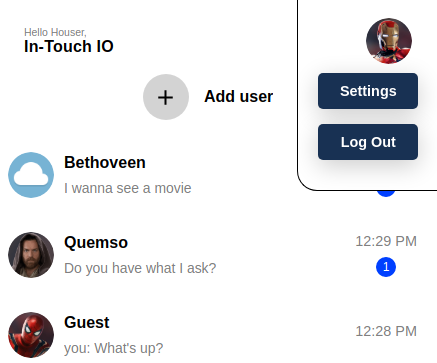

# Mern Messaging Application using Socket.IO, JSON Web Token (JWT) and Cloudinary

The application leverages the technologies of MongoDB, Express, Node and React, along with Socket.IO to deliver a complete real-time messaging application. Additionally, Cloudinary is employed to store user images which are used for profile pictures or within messages. The links returned by Cloudinary are saved in the user data within the database. 

The application is fully responsive, enhancing the user experience on both large and small devices. Users can create an account or choose to use the demo user provided in the login component to begin interacting with the application's features. Moreover, the authentication process leverages JSON Web Tokens (JWT) to secure user data and protect the application's routes.

  

# Application flow

## Login/Sign up

The application begins with the creation of an accountData validation occurs in the backend using the express-validator dependency to notify users whether their email or password is incorrect. The same validation process takes place in the sign-in component to ensure that:

- The email is available to use.
- The username must contain between 4 and 12 characters.
- The password must be at least 4 characters in length and include at least one uppercase letter and one number.

Upon creating an account, users are directed to the configuration route to choose a profile picture and change their username if desired. If users do not choose an image, a default image is used.

  

## Creating Chats

A button is provided to open a window for searching all users registered in the application. Depending on the input in the search component, MongoDB's regex feature returns a group of users that meet the criteria. When clicking on a card, the application creates a chat and highlights that the current user has been added with a green checkmark.

  

  

## Sending Messages

In the main window, all chats are displayed in a list sorted by date. A chat can be opened by clicking on any chat card. The chat component provides an input to start writing messages and allows users to add images to their messages. When new messages are received, the respective chat is updated with a timestamp. If the user is not in the corresponding chat, a number will appear showing the number of new messages in the chat. As soon as the chat is opened, that number is cleared.

  

## Log out and updating user's data

By hovering over the user's profile picture, a menu is displayed offering options to log out or update the user's data. When selecting the settings button, users are redirected to a different route to change their profile picture or username.

  

